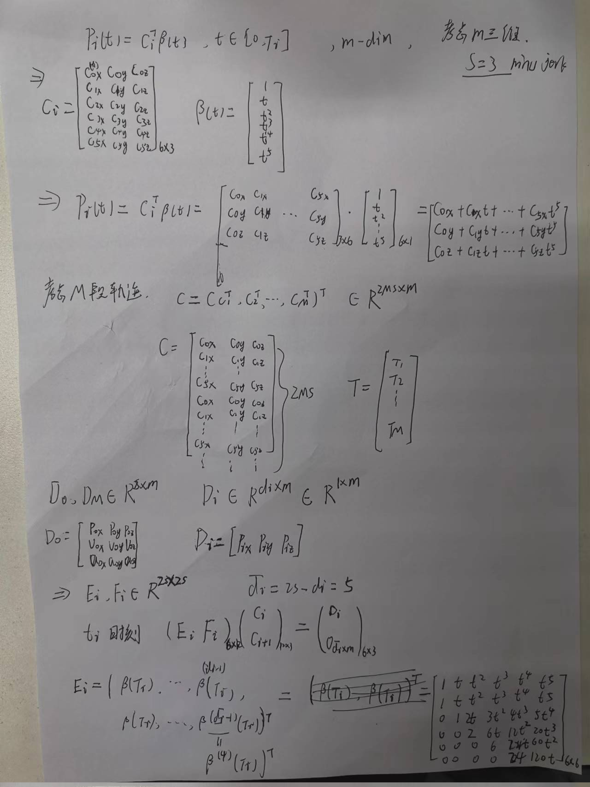
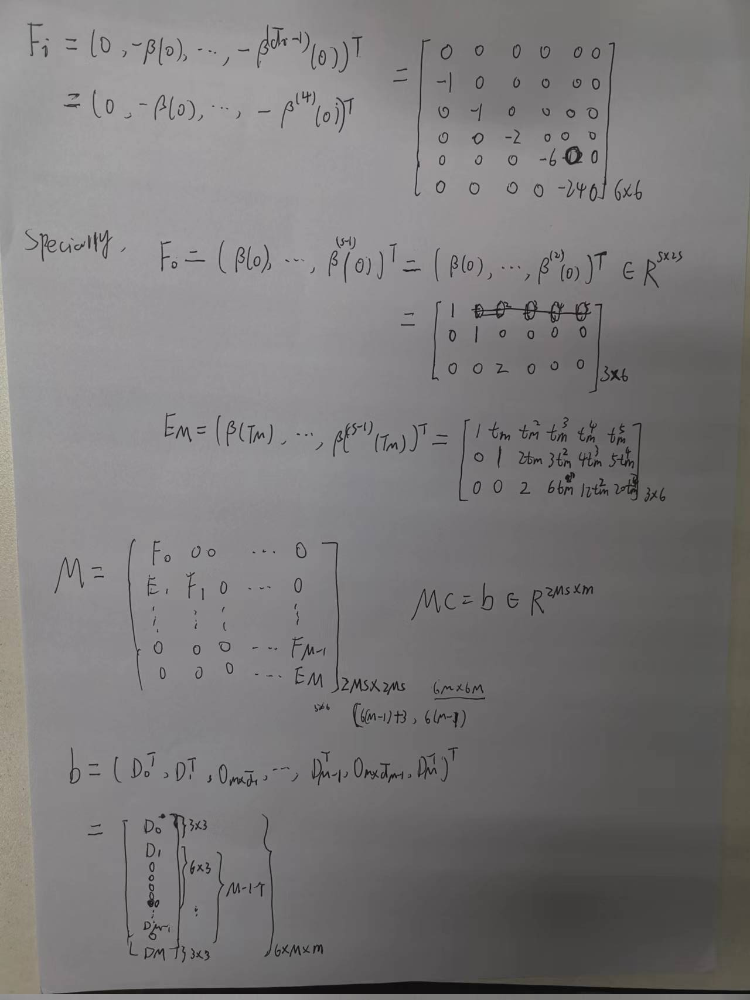
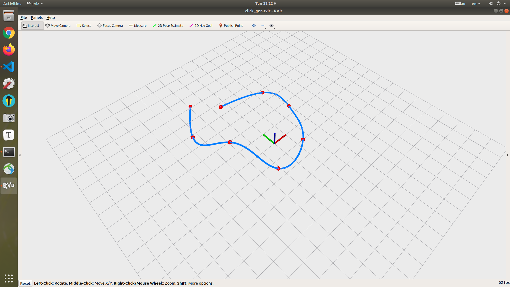
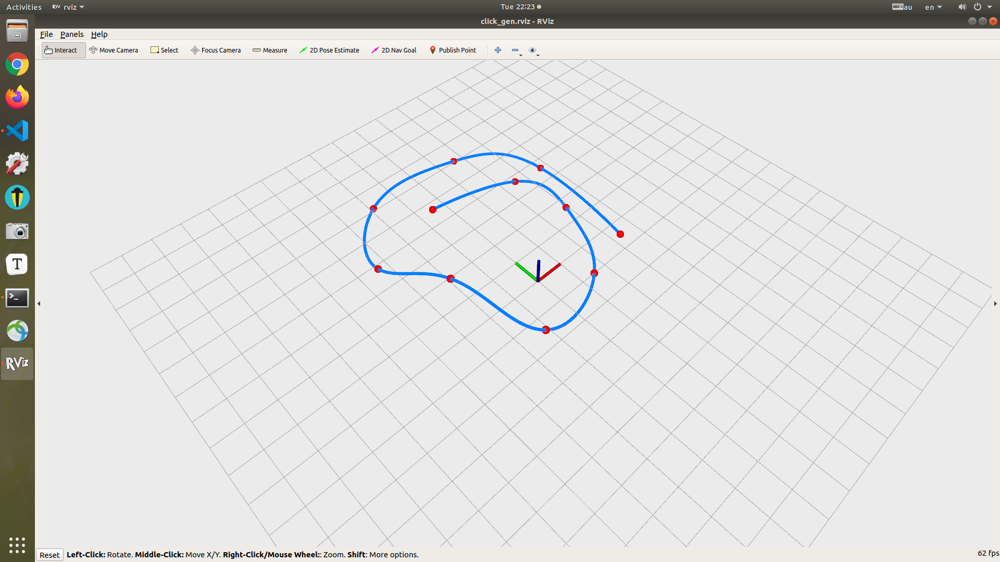
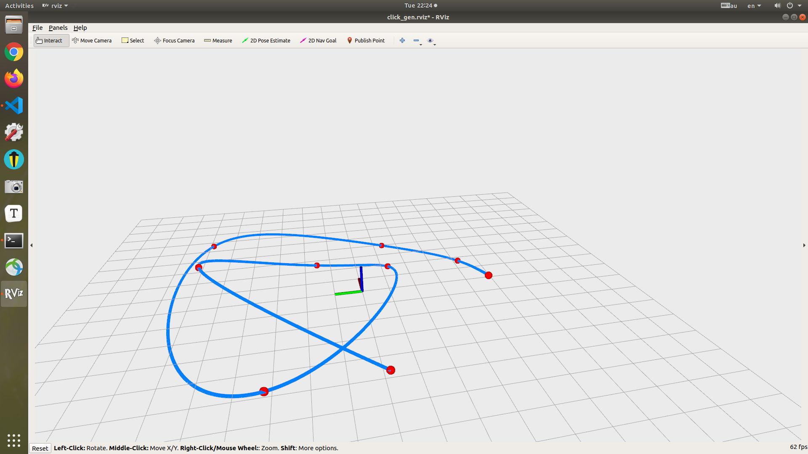
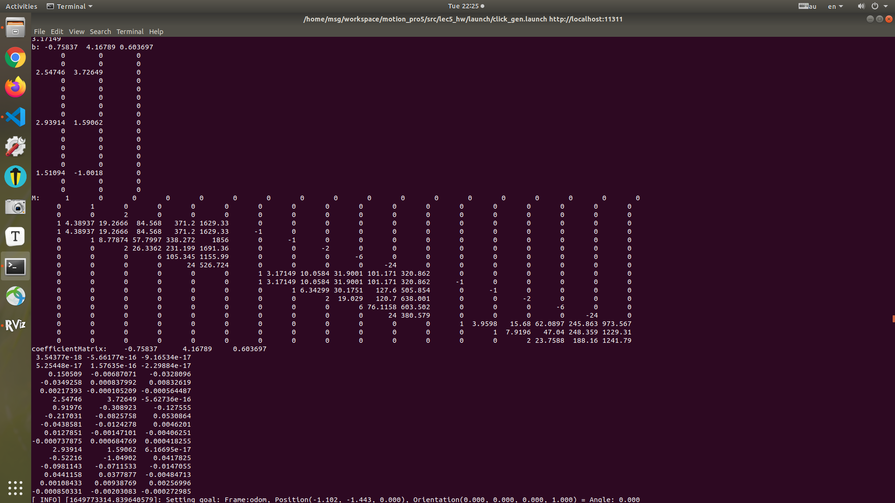

### Based-Optimization Trajectory planning

最优化方法求解minimum jerk trajectory公式部分参考论文：Wang et al. Geometrically Constrained Trajectory Optimization for Multicopters, TRO 2022

#### 手动推导

​	对其中一般情况$d_i=1$，$m=3$进行了手动推导，由于时间关系写在草稿纸上：





#### 核心代码实现

```c++

void minimumJerkTrajGen(
    // Inputs:
    const int pieceNum,
    const Eigen::Vector3d &initialPos,
    const Eigen::Vector3d &initialVel,
    const Eigen::Vector3d &initialAcc,
    const Eigen::Vector3d &terminalPos,
    const Eigen::Vector3d &terminalVel,
    const Eigen::Vector3d &terminalAcc,
    const Eigen::Matrix3Xd &intermediatePositions,
    const Eigen::VectorXd &timeAllocationVector,
    // Outputs:
    Eigen::MatrixX3d &coefficientMatrix)
{
    // coefficientMatrix is a matrix with 6*piece num rows and 3 columes
    // As for a polynomial c0+c1*t+c2*t^2+c3*t^3+c4*t^4+c5*t^5,
    // each 6*3 sub-block of coefficientMatrix is
    // --              --
    // | c0_x c0_y c0_z |
    // | c1_x c1_y c1_z |
    // | c2_x c2_y c2_z |
    // | c3_x c3_y c3_z |
    // | c4_x c4_y c4_z |
    // | c5_x c5_y c5_z |
    // --              --
    // Please computed coefficientMatrix of the minimum-jerk trajectory
    // in this function

    // ------------------------ Put your solution below ------------------------
    Eigen::MatrixXd M = Eigen::MatrixXd::Zero(pieceNum * 6, pieceNum * 6);
    Eigen::MatrixXd b = Eigen::MatrixXd::Zero(pieceNum * 6, 3);
    Eigen::MatrixXd F_0(3, 6);
    Eigen::MatrixXd E_m(3, 6);
    Eigen::MatrixXd E_i(6, 6);
    Eigen::MatrixXd F_i(6, 6);
    Eigen::MatrixXd D_0(3, 3);
    Eigen::MatrixXd D_m(3, 3);
    Eigen::MatrixXd D_i(1, 3);
    auto get_Em = [&](const double& T){
        Eigen::MatrixXd res(3, 6);
        res <<  1, T, pow(T,2), pow(T,3), pow(T,4), pow(T,5),
                0, 1, 2*T, 3*pow(T,2), 4*pow(T,3), 5*pow(T,4),
                0, 0, 2, 6*T, 12*pow(T,2), 20*pow(T,3);
        return res; 
    };
    E_m = get_Em(timeAllocationVector(pieceNum-1));
    // std::cout << E_m <<std::endl;
    F_0 << 1, 0, 0, 0, 0, 0,
            0, 1, 0, 0, 0, 0,
            0, 0, 2, 0, 0, 0;
    D_0.row(0) = initialPos;     
    D_0.row(1) = initialVel;
    D_0.row(2) = initialAcc;
    D_m.row(0) = terminalPos;
    D_m.row(1) = terminalVel;
    D_m.row(2) = terminalAcc;
    // std::cout << "D_0:" << D_0 << std::endl;
    // std::cout << "D_m: " << D_m << std::endl;
    std::cout << "inter: "<< "\n" << intermediatePositions<< std::endl;
    std::cout << "timeAllocationVector: " << "\n"<< timeAllocationVector<< std::endl;
    
    auto get_Ei = [&] (const double& T){
        Eigen::MatrixXd res(6,6);
        res <<  1, T, pow(T,2), pow(T,3), pow(T,4), pow(T,5),
                1, T, pow(T,2), pow(T,3), pow(T,4), pow(T,5),
                0, 1, 2*T, 3*pow(T,2), 4*pow(T,3), 5*pow(T,4),
                0, 0, 2, 6*T, 12*pow(T,2), 20*pow(T,3),
                0, 0, 0, 6, 24*T, 60*pow(T, 2),
                0, 0, 0, 0, 24, 120*T; 
        return res;
    };
    auto get_Fi = [](const double& T){
        Eigen::MatrixXd res(6,6);
        res <<  0, 0, 0, 0, 0, 0,
                -1, 0, 0, 0, 0, 0,
                0, -1, 0, 0, 0, 0,
                0, 0, -2, 0, 0, 0,
                0, 0, 0, -6, 0, 0,
                0, 0, 0, 0, -24, 0; 
        return res;
    };
    M.block(0,0,3,6) = F_0;
    M.block(6*pieceNum-3, 6*pieceNum-6, 3, 6) = E_m;
    b.block(0, 0, 3, 3) = D_0;
    b.block(6*pieceNum-3,0, 3, 3) = D_m;

    for(int i = 0;i < pieceNum-1; i++){
         //std::cout << "nowtime: " << "\n"<< timeAllocationVector(i)<<"\n";
        E_i = get_Ei(timeAllocationVector(i));
        F_i = get_Fi(timeAllocationVector(i));
        M.block(6*i +3, 6*i, 6, 6) = E_i;
        M.block(6*i +3, 6*i +6, 6, 6) = F_i;
        D_i = intermediatePositions.col(i).transpose();
        b.block(6*i+3,0, 1,3) = D_i;
        // std::cout << "D_i: " << D_i<< std::endl;
    }
    std::cout << "b: " << b<< std::endl;
    std::cout << "M:" << M <<std::endl;
    coefficientMatrix = M.colPivHouseholderQr().solve(b);
    std::cout << "coefficientMatrix:" << coefficientMatrix <<std::endl;
    // ------------------------ Put your solution above ------------------------
}
```

#### 仿真结果








> 两端轨迹相关参数矩阵如下



#### 仿真环境

ubuntu18.04 + melodic  
