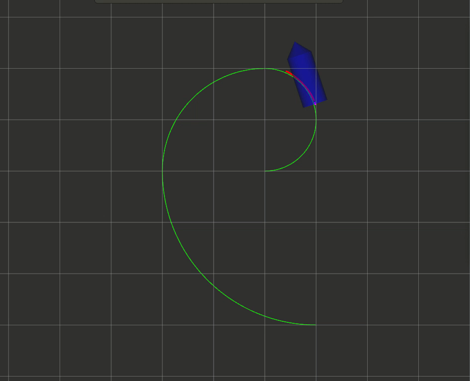

# MPC Control

### Linearize  Nonlinear Model

#### Problem description:

$$
J = \sum_{i=0}^N (x-x_r)^2+ (y-y_r)^2 + \rho * (\phi-\phi_r)^2
\\ s.t. -0.1 <= v_k <= v_{max} \\
     |a_k| <= a_{max} \\
     |\delta_k| <= \delta_{max} \\
     |\delta_{k+1} - \delta_k| / dt <= d\delta_{max}
$$

$$
osqp \ interface: \\
 minimize    \  0.5 x^T P x + q^Tx\\
 subject \ to  \ l <= A x <= u\\
 minimize    \  0.5 x^T P x + q^Tx\\
 subject \ to  \ l <= A x <= u
$$

将非线性模型泰勒展开后，整理成状态传递方程的形式如下：
$$
\begin{aligned}
\mathbf{\dot x} & =\mathbf{A_cx +B_cu+g_c}\\
\frac{ \mathbf {x_{k+1}-x_{k}}}{T_s}&=\mathbf{A_cx_k+B_cu_k+g_c}\\
\mathbf{x_{k+1}}&=(\mathbf I+ T_s\mathbf A_c)\mathbf {x_k}+T_s\mathbf{B_cu_k}+T_s\mathbf{g_c}\\
\mathbf{x_{k+1}}&=\mathbf{A_kx_k+B_ku_k+g_k}
\end{aligned}
$$
代价函数矩阵表达式如下：
$$
J\mathbf   {(z, \mathbf x_0)  =( X-X_{ref})^T\bar Q( X-X_{ref})}
$$
带入状态空间转移方程：
$$
J\mathbf {( z, x_0) 
     =(\bar A_d  x_0 +\bar B_d  z +\bar g_c -X_{ref})^T\bar Q(\bar A_d  x_0 +\bar B_d   z +\bar g_c -X_{ref})} \\
$$
其中$X$为$(\mathbf x_1^T,\mathbf x_2^T,\mathbf x_3^T,...,\mathbf x_N^T)^T,\mathbf x_i$为某一离散时刻的状态向量。

控制序列$\mathbf z$为待优化变量，对其求$J$的梯度，由此可得到OSQP求解器需要的P和q系数矩阵:
$$
\begin{aligned}
    \nabla _{\mathbf z} J &= \mathbf{P z +q}\\
    &=\mathbf{2\bar B_d^T\bar Q \bar B_d  z +2\bar B_d^T\bar Q(\bar A_d  x_0  +\bar g_c -X_{ref})}
\end{aligned} \\
$$
其中$X_{ref}$为跟踪的参考轨迹序列

#### With Delays

LInear model with delays:
$$
\mathbf{ \dot x} =\mathbf A(t) \mathbf x(t)+\mathbf B(t) \mathbf u(t-\tau)
$$
Delay-free model:
$$
\mathbf{\bar x_0} = \mathbf {t+\tau} \approx \widehat{\mathbf{x}}(t + \tau) = \mathbf{A}^\tau \mathbf{x}(t) + \sum_{j=0}^{\tau -1} \mathbf{A}^j\mathbf{B}\mathbf{u}(t-i-j) 
$$
我们只需要计算$\widehat{x}(t+\tau)$即可。

## HOW TO RUN

```
./install_tools.sh
catkin_make -j1
source devel/setup.bash
roslaunch mpc_car simulation.launch
```

## HOW TO TURN PARAMETERS

```
./src/mpc_car/config/mpc_car.yaml -> mpc parameters
./src/car_simulator/config/car_simulator.yaml -> initial states (in simulation)
```

## Simulation Result

<p align="center">
    
</p>

