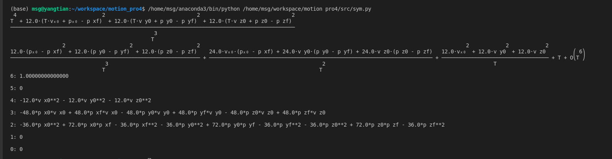
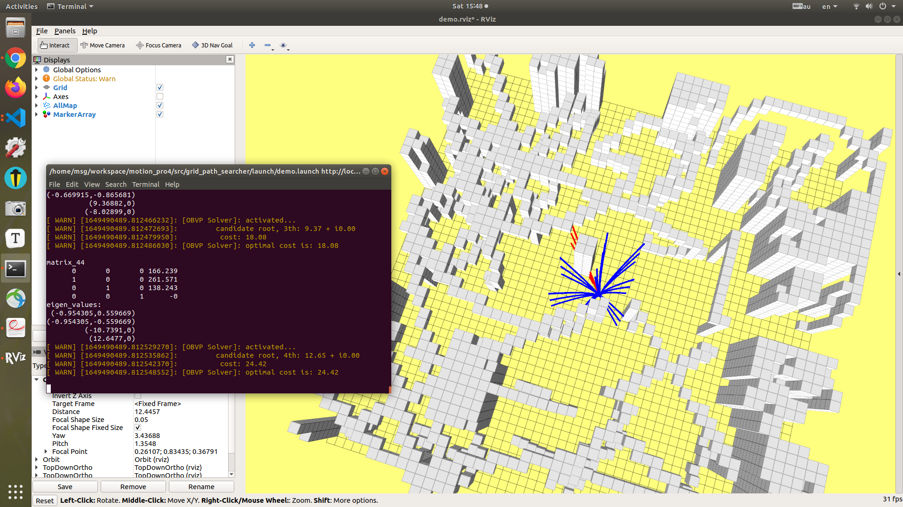

## Trajectory Generation OBVP

### obvp公式推导

```python
from operator import imod
from pyparsing import alphas
from sympy import *
from sympy.abc import T

p_xf = symbols('p_xf')
p_yf = symbols('p_yf')
p_zf = symbols('p_zf')
p_x0 = symbols('p_x0')
p_y0 = symbols('p_y0')
p_z0 = symbols('p_z0')
v_x0 = symbols('v_x0')
v_y0 = symbols('v_y0')
v_z0 = symbols('v_z0')
## 默认采用delta_v = 0
delta_p_x = p_xf - v_x0 * T - p_x0
delta_p_y = p_yf - v_y0 * T - p_y0
delta_p_z = p_zf - v_z0 * T - p_z0


alpha_1 = -12 / (T**3) * delta_p_x
alpha_2 = -12 / (T**3) * delta_p_y
alpha_3 = -12 / (T**3) * delta_p_z

# pprint(alpha_1)
# pprint(alpha_2)
# pprint(alpha_3)
beta_1 = 6 / (T**2) * delta_p_x
beta_2 = 6 / (T**2) * delta_p_y
beta_3 = 6 / (T**2) * delta_p_z
# pprint(beta_1)
# pprint(beta_2)
# pprint(beta_3)

J = T + (1 / 3 * (alpha_1**2) * (T**3) + alpha_1 * beta_1 * (T**2) + (beta_1**2) * T) + (1 / 3 * (alpha_2**2) * (T**3) + alpha_2 * beta_2 * (T**2) + (beta_2**2) * T) + (1 / 3 * (alpha_3**2) * (T**3) + alpha_3 * beta_3 * (T**2) + (beta_3**2) * T)
J = simplify(J)
pprint(J)
J_final = series(J,T)
pprint(J_final)
##
###
den = T**3
num = den * J

derivative = Poly(
    collect(
        expand(
            diff(num, T)*den - num*diff(den, T)
        ),
        syms=T
    ),
    T
)
#
# done:
#
for order, coeff in zip(
    range(len(derivative.all_coeffs()) - 1, -1, -1),
    derivative.all_coeffs()
):
    print(f"{order}: {coeff}\n")

```

固定末尾状态的v=start的速度，即delta_v=0;

以上均采用此种方式求解推导，结果如下：



我使用series（J, T）来对T进行级数展开好像有问题，希望助教指出问题。

#### obvp代码如下

```c++

double Homeworktool::OptimalBVP(Eigen::Vector3d _start_position,Eigen::Vector3d _start_velocity,Eigen::Vector3d _target_position)
{
    double optimal_cost = 100000; // this just to initial the optimal_cost, you can delete it

    const double p_x0 = _start_position(0);
    const double p_y0 = _start_position(1);
    const double p_z0 = _start_position(2);

    const double v_x0 = _start_velocity(0);
    const double v_y0 = _start_velocity(1);
    const double v_z0 = _start_velocity(2);

    const double p_xf = _target_position(0);
    const double p_yf = _target_position(1);
    const double p_zf = _target_position(2);

    const double p_x0_squared = pow(p_x0, 2);
    const double p_y0_squared = pow(p_y0, 2);
    const double p_z0_squared = pow(p_z0, 2);

    const double p_xf_squared = pow(p_xf, 2);
    const double p_yf_squared = pow(p_yf, 2);
    const double p_zf_squared = pow(p_zf, 2);

    const double delta_px = p_xf - p_x0;
    const double delta_py = p_yf - p_y0;
    const double delta_pz = p_zf - p_z0;

    const double delta_px_squared = pow(delta_px, 2);
    const double delta_py_squared = pow(delta_py, 2);;
    const double delta_pz_squared = pow(delta_pz, 2);;

    const double v_x0_squared = pow(v_x0, 2);
    const double v_y0_squared = pow(v_y0, 2);
    const double v_z0_squared = pow(v_z0, 2);
    // 按照公式合并较为简单
    auto CalCost = [&](const double T) {
        auto res = pow(T, 4) + 12 * pow(T * v_x0 - p_xf + p_x0, 2) + 12 * pow(T * v_y0 - p_yf + p_y0, 2) + 12 * pow(T * v_z0 - p_zf + p_z0, 2);
        return res / pow(T, 3);
    };
    
    // 按照T进行展开后为四次多项式，采用Eigen中伴随矩阵求解，获得多项式系数c_0、c_1、c_2、c_3,调用特征值获得实数大于零的解
    // 我最初采用sympy里面的series（J，T）进行化简，化简结果如下，但是会有问题，想请教一下助教为什么，后面采用的是参考助教的化简方法
    // double c_0 = 12 * delta_px_squared + 12 * delta_py_squared + 12 * delta_pz_squared;
    // double c_1 = - 24 * v_x0 * delta_px - 24 * v_y0 * delta_py - 24 * v_z0 * delta_pz;
    // double c_2 = 12 * v_x0_squared + 12 * v_y0_squared + 12 * v_z0_squared;
    // double c_3 = 0;

    double c_0 = -36*p_xf_squared + 72*p_xf*p_x0 - 36*p_x0_squared - 36*p_yf_squared + 72*p_yf*p_y0 - 36*p_y0_squared - 36*p_zf_squared + 72*p_zf*p_z0 - 36*p_z0_squared;
    double c_1 = 48*p_xf*v_x0- 48*p_x0*v_x0  + 48*p_yf*v_y0  - 48*p_y0*v_y0  + 48*p_zf*v_z0 - 48*p_z0*v_z0;
    double c_2 = -12 * v_x0_squared - 12 * v_y0_squared - 12 * v_z0_squared;
    double c_3 = 0;
    Matrix4d matrix_44;
    Matrix<complex<double>, Dynamic, Dynamic> matrix_eigenvalues;
    const double epsilon = 0.001;
    matrix_44 << 0, 0, 0, -c_0,
                1, 0, 0, -c_1,
                0, 1, 0, -c_2,
                0, 0, 1, -c_3;
    cout << "matrix_44" << endl << matrix_44 << endl;
    matrix_eigenvalues = matrix_44.eigenvalues();
    cout << "eigen_values: " << endl<< matrix_eigenvalues << endl;

    ROS_WARN("[OBVP Solver]: activated...");
    for (size_t i = 0; i < 4; ++i) {
        if ((matrix_eigenvalues(i).real() > epsilon) &&
            (abs(matrix_eigenvalues(i).imag()) < epsilon)
        ) {
            ROS_WARN(
                "\tcandidate root, %dth: %.2f + i%.2f", 
                static_cast<int>(i + 1), 
                matrix_eigenvalues(i).real(), 
                matrix_eigenvalues(i).imag()
            );
            double curr_cost = CalCost(matrix_eigenvalues(i).real());
            ROS_WARN("\t cost: %.2f", curr_cost);
            if (curr_cost < optimal_cost) {
                optimal_cost = curr_cost;
            }
        }
    }
    ROS_WARN("[OBVP Solver]: optimal cost is: %.2f\n", optimal_cost);
    return optimal_cost;
}

```

#### 仿真结果



#### 仿真环境：ubuntu18.04 + melodic  