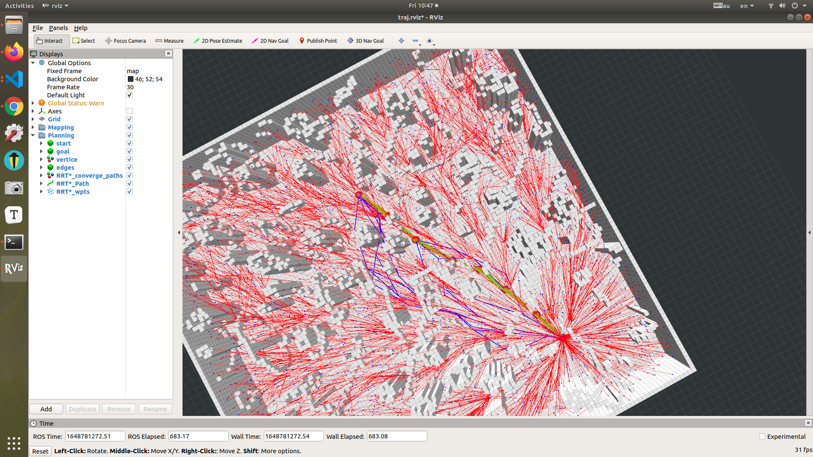

## RRT * 和 InformedRRT *作业分析

### RRT*代码相关实现细节

#### 获得new节点的最近节点作为父亲节点

```c++
	     // TODO Choose a parent according to potential cost-from-start values
        // ! Hints:
        // !  1. Use map_ptr_->isSegmentValid(p1, p2) to check line edge validity;
        // !  2. Default parent is [nearest_node];
        // !  3. Store your chosen parent-node-pointer, the according cost-from-parent and cost-from-start
        // !     in [min_node], [cost_from_p], and [min_dist_from_start], respectively;
        // !  4. [Optional] You can sort the potential parents first in increasing order by cost-from-start value;
        // !  5. [Optional] You can store the collison-checking results for later usage in the Rewire procedure.
        // ! Implement your own code inside the following loop
        /**/
        auto cmp = [&](RRTNode3DPtr& a, RRTNode3DPtr& b){ return a->cost_from_start < b->cost_from_start; };
        sort(neighbour_nodes.begin(), neighbour_nodes.end(), cmp);
        for (auto &curr_node : neighbour_nodes)
        {
          dist2nearest = calDist(curr_node->x, x_new);
          if(curr_node->cost_from_start + dist2nearest < min_dist_from_start && map_ptr_->isSegmentValid(curr_node->x, x_new)){
            min_node = curr_node;
            cost_from_p = dist2nearest;
            min_dist_from_start = curr_node->cost_from_start + dist2nearest;
          }
        }
        // ! Implement your own code inside the above loop
```

#### rewire操作

​	对所有邻居进行rewire，在实现过程中需要进行剪枝，障碍物check，判断是否需要改变父节点，最后进行change，我的Delay collision并不是叶博视频里提到的对潜在的cost-to-come值进行排序后，已经找到最好父节点了就不需要在进行collision check了，我只是简单的在前面对cost-to-start排序，会有一点点提升但相较于叶博的方式不够。

```c++
/* 3.rewire */
        // TODO Rewire according to potential cost-from-start values
        // ! Hints:
        // !  1. Use map_ptr_->isSegmentValid(p1, p2) to check line edge validity;
        // !  2. Use changeNodeParent(node, parent, cost_from_parent) to change a node's parent;
        // !  3. the variable [new_node] is the pointer of X_new;
        // !  4. [Optional] You can test whether the node is promising before checking edge collison.
        // ! Implement your own code between the dash lines [--------------] in the following loop
        for (auto &curr_node : neighbour_nodes)
        {
          double best_cost_before_rewire = goal_node_->cost_from_start;
          // ! -------------------------------------
          double dist_to_x_new = calDist(x_new, curr_node->x);
          // Delay Collision 
          if(curr_node->cost_from_start <= new_node->cost_from_start + dist_to_x_new){
            continue;
          }
          // Tree pruning
         // if(curr_node->cost_from_start + dist_to_x_new >best_cost_before_rewire){
           // continue;
         // }
            // 最初的剪枝有问题，修改过后提升
             if(new_node->cost_from_start + dist_to_x_new + calDist(curr_node->x, goal_node_->x) >=best_cost_before_rewire){
            continue;
          }
          // collision check
          if(!map_ptr_->isSegmentValid(x_new, curr_node->x)){
            continue;
          }
          // changeParent
          changeNodeParent(curr_node, new_node, dist_to_x_new);

          // !!!if  goal in rewire processing, then need judge now cost to goal whether is best after rewire!!!  
          // ! -------------------------------------
          if (best_cost_before_rewire > goal_node_->cost_from_start)
          {
            vector<Eigen::Vector3d> curr_best_path;
            fillPath(goal_node_, curr_best_path);
            path_list_.emplace_back(curr_best_path);
            solution_cost_time_pair_list_.emplace_back(goal_node_->cost_from_start, (ros::Time::now() - rrt_start_time).toSec());
          }
        }
        /* end of rewire */
```

### InformedRRT*代码相关实现细节

#### 椭圆球体内采样

​	相较于RRT*只改变了采样的范围，在未找到goal之前采样与RRT *相同，在找到一条通往目标的路径立马改变采样范围，具体实现需要计算椭球体中心坐标、旋转矩阵、以及椭球体的长轴和短轴。在采样过程参考论文里面Sample(x_start, X_goal, cmax)

```c++
 //椭球体采样
Eigen::Vector3d x_rand;
if(goal_found){
    sampler_.informedSamplingoval(x_rand);
}else{
    sampler_.samplingOnce(x_rand);
}  
```

```c++
void informedSamplingoval(Eigen::Vector3d &sample){
// 按照论文公式实现
    Eigen::Vector3d p;
    p[0] = normal_rand_(gen_);
    p[1] = normal_rand_(gen_);
    p[2] = normal_rand_(gen_);
    double r = pow(uniform_rand_(gen_), 0.33333);
    sample = r * p.normalized();
    sample.array() *= radii_.array();
    sample = rotation_ * sample;
    sample += center_;
  }
```

```c++
// 每次发现一条最优路径对椭球的长轴和短轴进行修改，缩小采样范围	 
scale_[0] = goal_node_->cost_from_start / 2.0;
scale_[1] = sqrt(scale_[0] * scale_[0] - c_min);
scale_[2] = scale_[1];
sampler_.setInformedSacling(scale_);
```

### 作业环境及使用方式

#### 环境：

​	ununtu18.04 + melodic 

#### 使用方式

> ​	拷贝我的src文件到catkin_workspace 下，catkin_make进行编译，我将RRT * 和InformedRRT * 用两个头文件实现，test_planner.cpp通过test_planners.launch里面的use_informed_rrt_star参数进行设置是否使用InformedRRT *.

source devel/setup.bash + roslaunch path_finder rviz.launch 即可

### 运行结果

#### RRT *





以上是剪枝操作有些问题，修改过后如下图，明显改善


#### InformedRRT *


