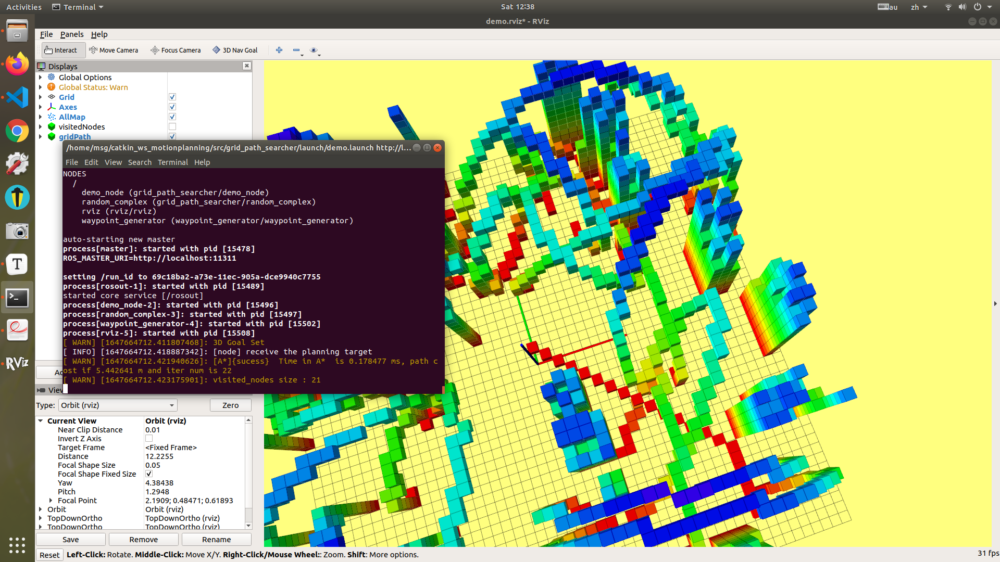
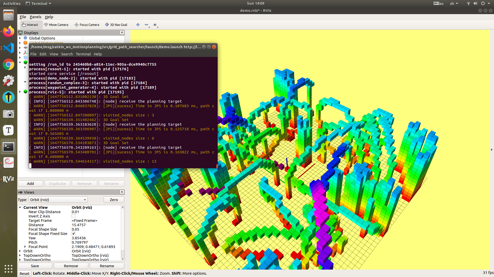
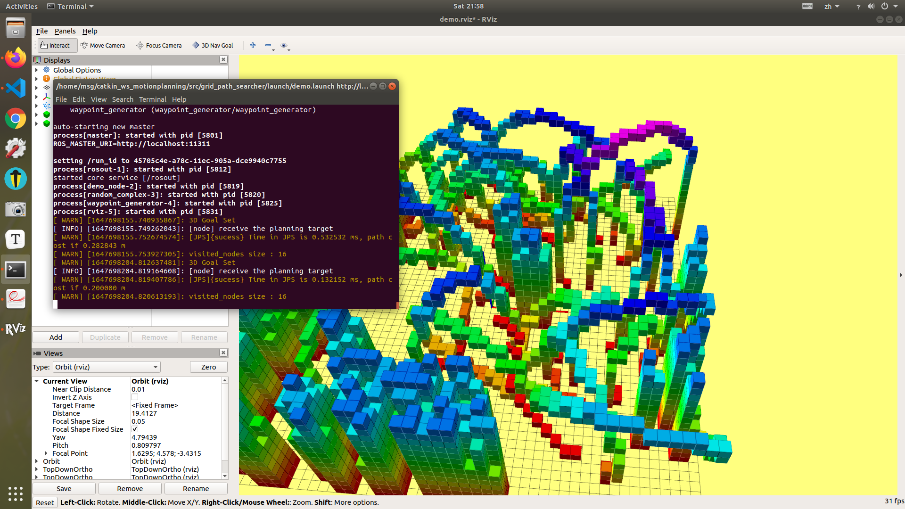
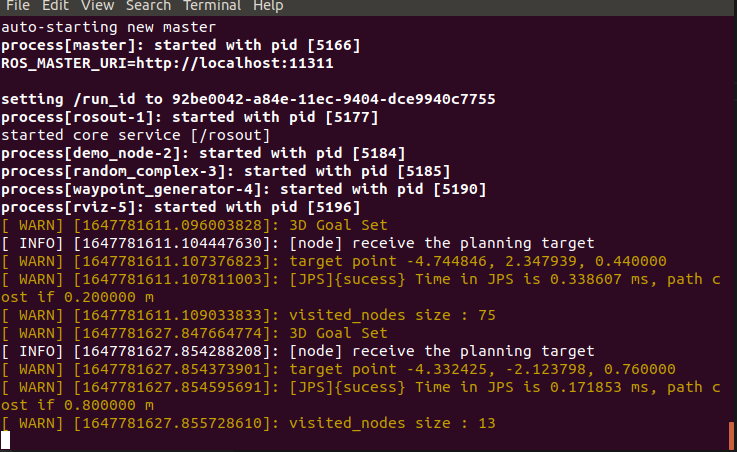

### A$*$和JSP算法流程和对比分析

#### 基础流程伪代码

```c++
Loop:
	init state of the start point, maintain a container e.g priority queue or multimap
    	while(!openset.empty()){
            if node n is goal, return true and record the endptr;
            for all unexpaned neighbors m of n{
                if (m id is new node){
                    g(m) = g(n) + Cnm;
                    compute f = g + getHeu(m,end);
                    push node m into queue;
                }esle if(g(m) > g(n) + Cnm){
                    g(m) = g(n) + Cnm;
                }
            }
        }
```

​	除了在拓展节点过程有所区别，a$*$对当前位置的八个方向每个邻居进行检查，对于包含障碍物和已经在close list中则跳过，而JSP采用三个规则完成查询，获取下一个拓展的跳点加入openlist。

​	多次实验发现，JSP相较于A$*$性能上有所提高，特别是openlist里面访问的节点大大减少，大部分操作在搜索后继节点。





- 启发式函数的设置，如何保证搜索的出路径optimality！需要满足$h(n) <= h^*(n)$，通常来说采用一下几个启发式函数

|     启发式函数     |         性能         |
| :----------------: | :------------------: |
|      欧式距离      |         可用         |
|     曼哈顿距离     |        不可用        |
|       L无穷        | 可用等价使用Dijkstra |
|         L0         | 可用等价使用Dijkstra |
| 对角线距离Diagonal |    最好的启发函数    |

- 由于拓展节点时候，会出现$f(n) = g(n)+h(n)$相等的情况，在依托广度优先的情况下，两个方向会同时拓展，会出现很多不必要的拓展，影响搜索效率，因此加入一个叫Tie Breaker的方式，把h修改为$h = h*(1.0+p)$，将h放大可以解决这个问题，在实验过程了也尝试使用和不使用，搜索效率上有所提升。
- 本次作业环境的初始位置默认0,0,1, 此时测试JSP和astar算法搜索效果差不多，我通过设置初始位置在障碍物前的空旷位置，并将目标设在障碍物内部，发现仅仅0.2m的距离JPS所耗时会翻了两倍，而Astar却没有这个问题，如下图0.2m的距离耗费0.33ms，而0.8m的稠密障碍物环境却只需要0.17ms，可见应用场景不同JSP和astar需要有所斟酌好坏。

#### 仿真环境已配置

Ubuntu18.04 + melodic ，src拷贝至工作区，catkin_make编译  source devel/setup.bash  roslaunch grid_path_searcher demo.launch即可

