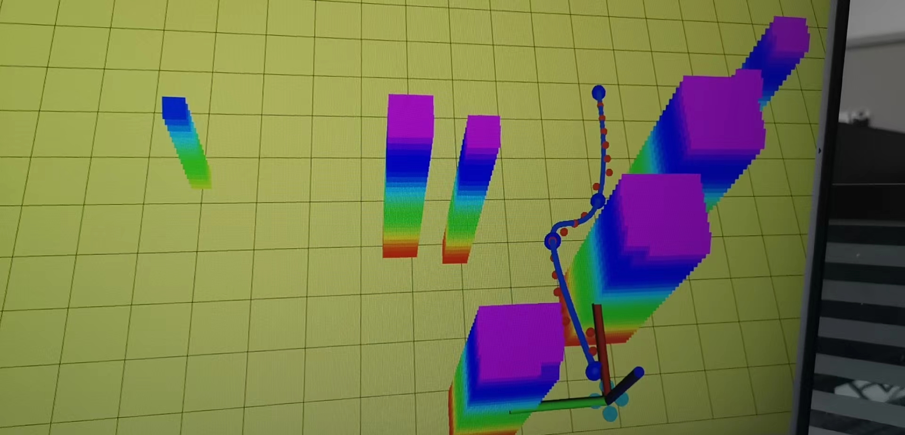
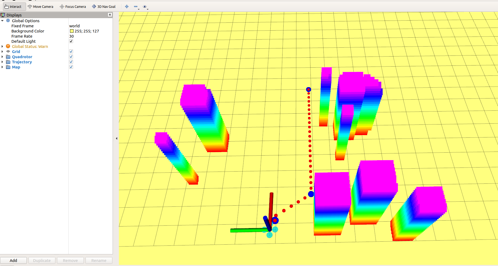
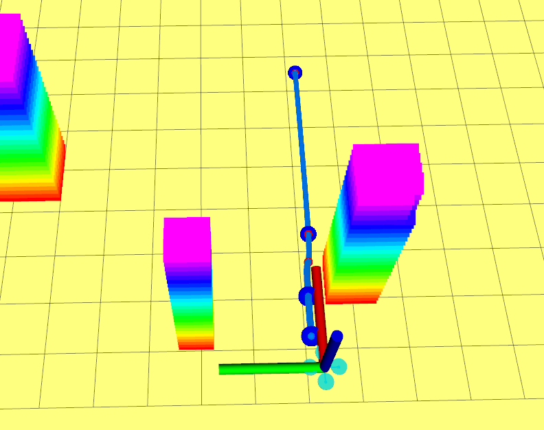
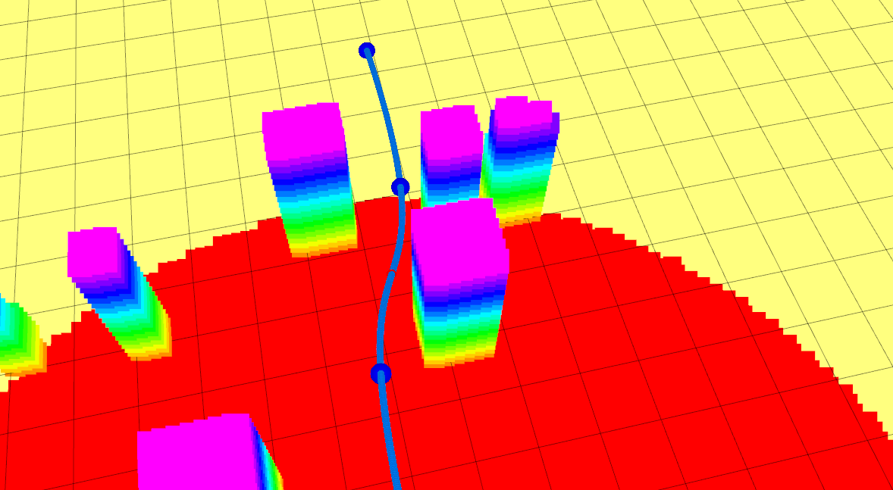

### **大作业**

本项目为深蓝学院《移动机器人运动规划》课程最终大作业。

#### 功能介绍：

1. 前端路径搜索，采用普通的A$*$搜索
2. 后端轨迹优化，采用了最优化理论、minimum snap两种方法均实现
3. 轨迹重优化以及轨迹重规划

#### 前端路径搜索+路径简化

​	A$*$搜索，heuristic设计为对角线距离，路径简化采用Ramer–Douglas–Peucker algorithm，代码细节参看大作业，如下图路径搜索的结果以及简化的路径点，其中红色点为A star出来的路径，蓝色点为经过简化的点。

#### 后端轨迹优化

本次作业利用最优化方法求解minimum jerk trajectory作为轨迹生成部分，参考论文：《Wang et al. Geometrically Constrained Trajectory Optimization for Multicopters, TRO 2022》；同样也实现了minimum snap原文的轨迹生成算法《Polynomial Trajectory Planning for Aggressive Quadrotor Flight in Dense Indoor Environments》

#### 重优化以及重规划

​	重优化中，对轨迹优化生成的轨迹进行安全检查，此部分采用对每段上离散点的方式进行安全检查，如此时不满足约束，则记录此时的段数，并在段中间插入一个点并重新进行轨迹生成，重复该操作直到通过安全检查。

​	重规划中，主要是无人机传感器受限，需要进行重规划来防止碰撞，重规划的触发条件参看状态机的条件，不再赘述。

#### 其他

- 采用了基于梯形速度曲线来分配时间（效果不是很好，特别是重优化后）
- 本作业采用插点的方式进行防止规划出的轨迹碰撞，我认为是不合适的，我在多次测试后发现，所插的点是在简化后的路径上进行，并不是按照大作业视频讲解里面提到的多次插点会退化为原始A$*$，而是近似的A$*$，因此在一些特殊情况仍会通过不了路径安全检查，特别是简化的路径阈值调大尤为明显，此时会陷入死循环不断的插点。

#### 运行注意事项

- 修改多项式阶数5阶，`<param name="planning/dev_order"          value="3"/>`
-   加入了`nh.param("planning/is_based_optimization", is_based_optimization, true)`作为是否使用最优化理论生成轨迹
- 运行所需依赖参看大作业说明.md

#### 仿真结果

- 路径搜索点及简化，如下图

  

- 重优化插点，如下图，在两个蓝色点之间插入了一个红色的点并重新优化的轨迹

  

  

- 无重规划(*4.0 speed)

  

- 最终效果图(*4.0 speed)

  

#### 完结撒花！

  

